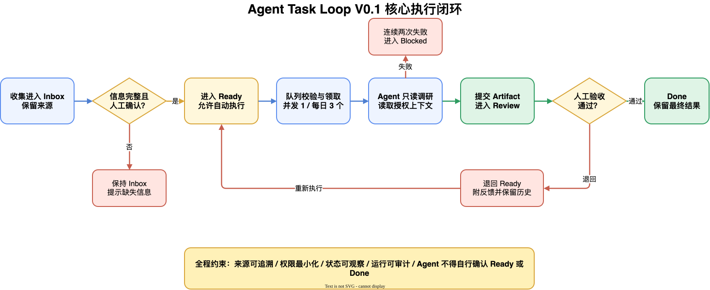

# Agent Task Loop

Agent Task Loop（ATL）是一套运行在 Obsidian 里的个人待办工作流：把工作、微信同步笔记和每日复盘中不断出现的想法统一收进 Inbox，再由你自己安排、推进和完成。需要时，可以让 AI 帮你整理任务，或把调研任务交给后台 Agent。

> 当前是个人使用优先的 MVP。Markdown 是唯一事实源，任务不会被锁在某个云端服务中。



## 你可以怎么用

最轻量的用法不需要自动 Agent：

1. **收集**：在 Obsidian 随手新建，或从“笔记同步助手”提取待办。
2. **决定**：在 Inbox 中保留、忽略，或点击“移到待办”。普通任务只需要标题。
3. **安排**：在 TaskNotes 看板中拖动状态，再从“ATL：统一日历”的“待排期任务”安排日期和时间。
4. **推进**：自己把任务从“待办”移到“进行中”，完成后移到“已完成”。
5. **需要 AI 时再用**：在任意 TaskNotes 任务上选择“智能完善任务”，共同补全目标、下一步和完成条件；也可以让思考教练启发你确认本周重点，或授权 ATL Runner 做只读调研。

默认看板有五个主要状态：

```text
收件箱 → 待办 → Agent 待执行 → 进行中 → 已完成
 Inbox     Ready   Agent Executable   In Progress   Done
```

“Agent 待执行”只用于已经明确交给 Agent 的任务，普通人工任务可以一直留在其余四列中。这五列只是推荐起点。状态由 TaskNotes 管理，你可以改显示名称、调整顺序或增加“等待回复”“以后再做”等状态；ATL 会保留这些自定义状态。

## 产品能力

### 1. 统一收件箱

- 点击 Obsidian 左侧“ATL：新建任务”，立即记录一个想法。
- 把想法发给“笔记同步助手”后，点击“ATL：从同步助手获取待办”，实时提取候选。
- 每日复盘也可以通过同一 ATL 收集服务提交候选。
- 实时扫描与每日复盘共用 `sourceKey` 去重，同一来源的同一行动只保留一条。
- AI 产生的候选始终进入 Inbox，不会直接开始执行。

### 2. 人工优先的任务管理

在 Inbox 任务的文件菜单中选择“移到待办”，会打开 Obsidian 原生居中弹窗：

- 项目可选；
- 目标可选；
- 完成条件可选；
- 优先级可调整；
- 普通任务不会自动授权给 Agent。

因此，“记下一个待办”和“定义一个可自动执行的任务”不再是同一件事。你可以先只写标题，后面再补充。

### 3. 可视化看板与日历

[TaskNotes](https://github.com/callumalpass/tasknotes) 负责卡片、看板、筛选和日历，ATL 负责收集、去重、任务文件和可选自动化。ATL 不是 TaskNotes 的 fork，也不会修改 TaskNotes 插件代码或私有配置。

ATL 可以为 `10_Tasks/Views/任务总看板.base` 应用默认四列布局，并在首次修改时保存 `.atl-backup`。推荐布局还会让同一时段的日历事件并排显示，避免任务和钉钉日程相互遮挡。开启“ATL 紧凑卡片”后，过长的日历标题会在卡片内单行显示并以 `...` 省略；打开事件仍可查看完整标题。之后仍可直接使用 TaskNotes 自定义状态和视图。

点击 Obsidian 左侧“ATL：统一日历”，可以在同一个 Base 中切换：

- **统一日历**：同时显示 `10_Tasks` 中已安排时间的本地任务，以及 `TaskNotes/DingTalk` 中同步来的钉钉日程；
- **待排期任务**：显示尚未设置 `scheduled` 的未完成任务，避免任务进入“待办”后从日历工作流中消失。

看板状态和日历时间是两套独立信息。把任务拖到“待办”只表示决定要做，不会擅自把它安排到今天；为任务设置 `scheduled` 后，它才会出现在日历对应的日期和时间。统一日历文件首次打开时由 ATL 创建；旧版本升级只补充必要的布局选项，并保留你的其他视图配置。

### 4. 个人首页与本周思考教练

点击 Obsidian 左侧“ATL：个人首页”，或在命令面板运行“打开个人首页”。这里汇总工作贡献、任务推进与输入积压，不替代 TaskNotes 看板：

- **今日完成**：今天有可核对完成事件的不同任务数；同一任务同一天只计一次。
- **本周完成**：从本周一到今天的完成任务数。
- **连续完成**：从今天（今天没有完成时从昨天）向前连续有完成记录的天数。
- **今日 Normalized Token**：OpenToken 汇总的当天标准化 Token 数；不按项目拆分。
- **贡献热力图**：固定显示最近 26 周，点击日期可以查看当天主要项目、任务和 Agent 产出。
- **趋势**：同时查看每日完成任务和每日 Normalized Token 的变化。
- **当前最值得推进的三件事**：默认显示现有任务候选；确认本周判断后，只把这里替换为你确认的 0 至 3 项判断。

标题右侧的按钮会按本周状态显示“梳理本周重点”“继续本周思考”或“查看本周判断”。点击后在 Obsidian 内打开思考教练：

- 你决定本次允许读取哪些目标、项目、任务、日历和复盘资料；“笔记同步助手”和“每日所思”每次会话默认不授权；
- AI 每轮只追问一个可能改变判断的问题，区分事实、推测和信息缺口，不替你决定 Top 3；
- 可随时绕过 AI 人工整理，保存草稿后继续，或确认 0 至 3 项本周判断；
- 确认后写入 `05_Reviews/Weekly/<周次> 周度重点.md`，字段和状态均为中文，并预留人工复盘区；
- 这个过程不会创建任务、修改任务状态或执行工作。

任务贡献只使用 ATL Audit 中的“确认通过”或“生命周期进入已完成”事件，不用 `updated_at` 猜测完成日期。历史已完成任务如果没有可核对事件，会在首页显示提示，不会悄悄计入。OpenToken 暂时不可用时，任务贡献、热力图和任务产出仍然可用，Token 区显示恢复提示。

首页只读读取 Vault 的任务、项目和 Audit；它不会自动改状态，也不会触发 Agent。OpenToken 由 ATL 自动探测本机安装，设置页只说明数据来源；ATL 不保存 Token 原始会话、API Key 或模型凭据。

### 5. 钉钉日历只读同步

ATL 可以把钉钉主日历同步成 TaskNotes 可识别的本地任务文件：

- 启动 Obsidian 时同步，之后每 15 分钟同步，也可随时点击“立即同步”；
- 只读取主日历：回看最近 7 天，并继续覆盖未来 90 天；
- 历史日期独立读取，个别日期失败不会阻断其他日期，失败范围会在下次同步时重试；
- 文件保存在 `TaskNotes/DingTalk/`，不会进入 ATL 的 `10_Tasks` 看板或 Agent 队列；
- 使用 `scheduled` 和 `timeEstimate`，可以在 TaskNotes 日历里拖到其他时间；
- 钉钉未改动时，保留你的本地拖动、项目、标签、优先级、状态和备注；
- 钉钉修改标题、时间、时长或取消日程时，下次同步更新这些钉钉托管字段；
- 日程结束后，下一次同步会把仍在进行的本地副本标记为 `done`；取消日程仍保持 `cancelled`；
- 你删除本地副本后，ATL 会记住这一决定，不会在下一轮自动重新导入。

这是严格的单向同步：ATL 不会创建、修改或删除任何钉钉日程。连接密码保存在 Obsidian `SecretStorage`，不会写入插件设置文件或 GitHub 仓库。

### 6. 会议听记与待办提取

在 `TaskNotes/DingTalk/` 的钉钉日程文件上打开文件菜单，选择“添加会议听记”，即可把面试、讨论或复盘原文关联到这次日程：

- 可以直接粘贴听记，也可以从本机导入 `txt`、`md`、`docx` 或 `pdf`；
- 可以关联多个补充文件。`txt`、`md`、`docx`、`pdf`、`csv` 和 `xlsx` 可选择是否参与分析，图片、音视频等其他格式只在本地保存；
- 听记和附件复制到 `08_Meetings/YYYY-MM/`，不修改原文件，不写入钉钉镜像，也不回传钉钉；
- “保存并分析”会在同一弹窗展示摘要、结论、来源引文和待办候选，候选默认不勾选；
- 再次打开同一日程会恢复已有结果；原文或分析资料变化后保留旧结果并提示重新分析；
- 只有你明确勾选的候选会进入 ATL Inbox，未选候选继续留在会议笔记；
- 同一次日程重复操作会复用已有会议笔记，不覆盖人工补充；
- 会议候选默认不可自动执行，后续仍由你在 Inbox 中决定、安排和授权。

AI 分析只接收当前日程信息、听记原文和你显式勾选的可解析资料；未勾选资料不会进入模型提示词。分析过程不联网搜索，也不执行任务。会议候选后续被明确授权给 Agent 时，ATL 只按任务保存的 `sourceNote` 读取这份会议笔记，并在发送模型前执行敏感令牌脱敏；它不会扫描整个 Vault。

单个附件最大 50 MiB，单个文档最多提取 100,000 个字符；DOCX 解压后内容超过 64 MiB 会拒绝解析，PDF 最多解析 500 页和 100,000 个文本项。CSV/XLSX 合计最多 10,000 行、每行最多 256 列；XLSX 最多 20 个工作表，解压后内容不能超过 128 MiB。关联资料在你勾选并开始分析前不会解析。附件被移动或删除时，会议弹窗仍可打开并标出不可用文件，你可以移除后重新分析。

### 7. 智能完善现有任务

在 `10_Tasks/Inbox`、`10_Tasks/Active` 或 `10_Tasks/Archive` 中，只要 Markdown 的笔记属性包含 `type: task`，就可以使用这项能力。文件名可以是 TaskNotes 创建的中文标题，不要求是 `task-*.md`。

打开任务文件后，在命令面板运行“智能完善当前任务”；也可以在文件列表中右键任务，选择“智能完善任务”。弹窗会读取当前标题和正文，并让你直接填写或调用已配置的模型生成：

- 任务目标；
- 下一步动作；
- 完成条件。

保存只会在原文件中补充稳定任务 ID 和 `task_brief`，不会改名、移动文件，也不会改变状态、计划时间、优先级、项目、自定义字段或正文。普通 TaskNotes 任务不会因为使用这项能力而进入 ATL Agent 队列；自动执行、索引和归档仍要求标准 ATL 任务格式。

### 8. AI 帮我整理

“移到待办”弹窗中可以填写一句补充说明，再点击“AI 帮我整理”。AI 只回填：

- 一个清晰的任务目标；
- 1 至 5 条可检查的完成条件。

生成结果仍可编辑。AI 不会在这个步骤执行任务、读取其他文件或替你选择项目和优先级；AI 不可用也不影响把任务移到待办。

### 9. 复制给 Codex

任意 ATL 任务文件的菜单中都可以选择“复制给 Codex”。剪贴板内容包含任务文件绝对路径、标题、正文、项目、目标、完成条件、状态和来源摘要。粘贴到 Codex 后即可继续工作。

这个动作只复制上下文，不启动进程、不自动修改任务。

### 10. 可选的自动调研

ATL Runner 可以在每天 `08:00` 至 `22:00` 的每个整点检查一次队列，并执行明确授权的只读调研。先在 Inbox 中把任务“移到待办”，补齐执行上下文后，再从任务文件菜单选择“授权 Agent 执行”；命令面板也提供同名命令。只有同时满足以下条件的任务才会被领取：

1. 状态为 `agent_executable`；
2. 类型为 `research`；
3. 已关联项目；
4. 已填写目标和至少一条完成条件；
5. 权限为 `read_only_research`；
6. 用户已经完成上述显式授权。

普通手工待办保持 `ready`，不会被 Runner 领取。`auto_executable` 只保留为兼容镜像字段，不再作为领取授权信号。当前不设每日执行数量上限，但同一时间仍只运行一个 Agent 任务。

Runner 在实质执行前会冻结本次 Runtime Pack，记录任务与运行 ID、权限、实际加载的上下文块哈希、来源引用和上一版 Artifact 引用。Manifest 保存在本机 `.atl-runtime/context-packs/`，不复制来源文件正文；Agent 产出的 Artifact 和 Audit 都会绑定同一个 `pack_id`。决策续跑或要求修改会生成新的 Runtime Pack，因此可以核对每一版结果实际使用了哪一版上下文。

当前 Runtime Pack 只冻结任务已明确关联的来源：任务来源笔记、项目描述、项目资源和上一版 Artifact 摘要。它尚不负责自动发现更多代码仓库、会议、长期记忆或 Skill；这些候选源的动态选择和解释属于后续 Context Control Plane。

## 安装

ATL 尚未进入 Obsidian 社区插件市场。安装插件本身不需要终端：

1. 打开 [GitHub Releases](https://github.com/PANGKAIFENG/agent-task-loop/releases)，下载最新的插件压缩包。
2. 解压并确认包含 `main.js`、`manifest.json`、`styles.css` 和 `atl-runner.mjs`。
3. 在 Finder 中打开 Vault，按 `Command + Shift + .` 显示隐藏文件。
4. 进入 `.obsidian/plugins/`，创建 `agent-task-loop` 文件夹并放入上述文件。
5. 重启 Obsidian，在“设置 → 第三方插件”中启用 `Agent Task Loop`。

推荐同时安装 TaskNotes，以获得看板和日历体验。

### 能力前提

| 你要使用的能力 | 需要什么 |
| --- | --- |
| 随手新建、Inbox、手工看板管理 | Obsidian 桌面版、ATL；推荐 TaskNotes |
| 钉钉日历只读同步 | Obsidian 1.11.4+、TaskNotes、钉钉 CalDAV 地址/账号/密码 |
| 保存会议听记 | 已同步到本地的钉钉日程、允许 ATL 管理此 Vault |
| 会议 AI 分析与待办提取 | 已登录的 Claude Code；可沿用 CC-Switch 配置 |
| 本周思考教练 | 允许 ATL 管理此 Vault；使用 AI 时需已登录 Claude Code，也可沿用 CC-Switch 配置 |
| 从同步助手提取、AI 帮我整理 | 已登录的 Claude Code；可沿用 CC-Switch 配置 |
| 定时自动调研 | Node.js 24+、Claude Code、启用 ATL 后台执行 |

ATL 不保存 API Key。Model 和 Base URL 可在插件设置中配置；登录和密钥仍由 Claude Code 或系统环境管理。

## 第一次使用

1. 打开“设置 → Agent Task Loop”。
2. 开启“允许 ATL 管理此 Vault”。
3. 在“任务看板”中点击“应用人工任务布局”。
4. 点击左侧“ATL：新建任务”，创建第一条 Inbox 任务。
5. 在任务文件菜单中选择“移到待办”。
6. 点击左侧“ATL：统一日历”，在“待排期任务”中为任务安排时间。
7. 回到“统一日历”查看本地任务和钉钉日程。

需要同步钉钉日历时，再到“设置 → Agent Task Loop → 钉钉日历”填写连接并点击“测试连接”。这项能力不需要终端，也不要求开启 ATL 后台 Agent。

只有要使用 AI 整理、同步提取或自动调研时，才需要继续配置 Claude Code、Model、Base URL 和后台执行。

完整步骤见[Obsidian 用户操作指南](docs/operations/obsidian-plugin.md)。

## 数据保存在哪里

```text
10_Tasks/
├── Inbox/       # 新收集、尚未决定的任务
├── Active/      # 已进入日常管理的任务
├── Archive/     # ATL 归档的完成或取消任务
├── Projects/    # 可选的项目上下文
├── Artifacts/   # Agent 调研结果
├── Views/       # 任务总看板、统一日历等 TaskNotes Base
└── _System/     # 索引、审计和内部状态

TaskNotes/
└── DingTalk/    # 钉钉日历的本地可拖动副本，不进入 ATL 队列

08_Meetings/
└── YYYY-MM/     # 会议笔记、AI 总结以及按日程隔离的 attachments/

05_Reviews/
└── Weekly/      # 你确认的中文周度重点与人工复盘区
```

TaskNotes 的 `scheduled`、`due` 等字段和其他未知 frontmatter 会原样保留。会议听记正文和分析结果保存在 `08_Meetings` 的 Markdown 中，附件保存在相邻的 `attachments/`；它们不会进入钉钉或本 GitHub 仓库。个人任务正文、原始笔记和 Agent 登录凭据同样不会写入仓库。

## 当前边界

MVP 已覆盖人工收集、轻量推进、自定义状态、看板、日历、AI 字段整理、Codex 交接和受控调研。当前仍不包含：

- 多轮对话式任务规划；
- Agent、Skill、小队和多 Agent 编排；
- 团队协作、云同步、SaaS 托管和移动端；
- Obsidian 对钉钉日历的双向回写；
- Obsidian 内完整的 Review 验收按钮与异常恢复工作台；
- 自动判断普通任务或 Agent 产出的事实正确性并标记为 Done；钉钉日程副本仅按明确的结束时间自动完成。

底层服务已经支持验收通过、带反馈退回、标记阻塞和取消，但当前 Obsidian 界面只能查看 Review 任务与 Artifact。非关键问题通过 [GitHub Issues](https://github.com/PANGKAIFENG/agent-task-loop/issues) 管理，MVP 不为未验证需求提前增加复杂度。

## 面向开发者

只有开发、测试和深度排障需要终端。开发环境需要 Node.js 24+ 与 pnpm 10+。

```bash
pnpm install
pnpm typecheck
pnpm lint
pnpm test
pnpm build
```

- 产品需求：[Agent Task Loop V0.1 PRD](docs/PRD-Agent-Task-Loop-V0.1.md)
- 用户操作：[Obsidian 用户操作指南](docs/operations/obsidian-plugin.md)
- CLI 与本地开发：[开发者快速开始](docs/operations/developer-cli.md)
- 调度器维护：[本地研究任务调度](docs/operations/scheduler.md)
- 贡献指南：[CONTRIBUTING.md](CONTRIBUTING.md)
- 安全问题：[SECURITY.md](SECURITY.md)

## 开源协议

Agent Task Loop 使用 [Apache License 2.0](LICENSE) 开源。
