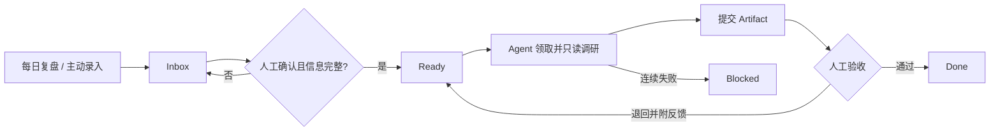

# Agent Task Loop V0.1 PRD

## 0. 文档信息

| 字段 | 内容 |
| --- | --- |
| 功能名 | Agent Task Loop V0.1 |
| 需求类型 | PRD-ai-native |
| 当前状态 | 已确认，可进入实施计划与开发 |
| 第一用户 | 产品所有者本人 |
| 关联模块 | 任务收集、任务管理、Agent 执行、Artifact、人工验收 |
| 更新时间 | 2026-07-14 |

**本期只解决：把每日复盘和工作中产生的想法收进一个可管理、可被 Agent 安全读取和执行、并由用户最终验收的个人任务闭环。**

## 1. 模块定位

Agent Task Loop 是个人工作系统中的任务执行中枢。它将零散想法和候选待办转为结构化任务，以项目和状态进行管理，并向 Claude Code、Codex 等 Agent 提供受限的调研执行入口，最终把结果交还用户验收。

一期不是通用智能体平台，也不是 Multica 的功能复刻。Multica 仅作为信息架构和任务状态管理的现状参考；本期只吸收全局 Inbox、项目看板、任务状态、Agent 领取和人工审核等适合个人闭环的逻辑。

## 2. 功能目标

### 2.1 用户价值

- 统一承接每日复盘和工作中主动录入的想法，降低遗漏。
- 将候选想法与可执行任务分开，避免任务池持续膨胀。
- 以项目和状态看板管理任务，随时知道待确认、执行中、待验收和阻塞事项。
- 将适合自动完成的调研交给 Agent，用户只处理确认、验收和关键判断。

### 2.2 AI 价值

- 只领取目标和验收标准完整的调研任务。
- 在明确权限内读取公开资料和任务引用的本地上下文。
- 输出可追溯的独立 Artifact，而不是把结果散落在多个会话中。
- 通过人工反馈进入下一次执行，形成有限、可审计的改进闭环。

### 2.3 成功标准

- 每日复盘和主动录入都能稳定进入 Inbox，并保留来源。
- 未经人工确认的候选任务不会被 Agent 领取。
- 用户可以按项目和状态管理任务，并完成确认、验收、退回、阻塞和取消。
- Agent 可以自动完成简单只读调研，结果包含结论、证据、不确定项和建议动作。
- 所有自动执行都可追踪，且没有越权修改代码、配置或对外发送。

### 2.4 非目标

- 不建设 Agent、Skills、小队和多 Agent 编排中心。
- 不自动扩写模糊任务；不完整任务继续留在 Inbox。
- 不允许 Agent 自动修改代码、配置、正式日程或对外发送消息。
- 不把 GitHub Issues 作为个人真实任务的事实源。
- 不在一期支持团队协作、公开 SaaS 或移动端。

## 3. 用户场景

### 场景一：每日复盘产生候选任务

每日复盘从个人小记中识别明确待办或推断任务，写入 Inbox 并保留原始笔记引用。任务默认不可执行，用户需要确认目标、项目和验收标准后，才能进入 Ready。

### 场景二：工作中快速记录

用户在并行会话或工作过程中快速记录一个想法。系统只要求最少的标题和来源即可收下，避免打断当前工作；之后用户在 Inbox 集中整理并决定确认、保留或取消。

### 场景三：Agent 自动完成调研并等待验收

调度器发现符合条件的 Ready 任务后，Agent 领取任务，读取项目上下文和允许访问的资料，完成公开资料调研并提交 Artifact。任务进入 Review，只有用户验收通过后才能进入 Done。

## 4. 双轨协作定义

| 阶段 | 人工动作 | AI / Agent 动作 | 系统反馈 | 边界 |
| --- | --- | --- | --- | --- |
| 收集 | 记录想法或完成每日复盘 | 从已授权来源生成候选任务 | 显示来源、创建时间和 Inbox 状态 | 不自动确认，不自动执行 |
| 整理 | 补全项目、目标和验收标准 | 校验信息是否达到 Ready 门槛 | 明确缺失项或允许确认 | 一期不自动扩写任务 |
| 确认 | 主动确认可执行并开启自动执行 | 不代替用户做确认 | `Inbox → Ready` | `auto_executable` 必须由用户开启 |
| 领取 | 可手动触发，也可等待调度 | 按队列规则领取一个安全任务 | `Ready → In Progress`，展示执行记录 | 并发和每日额度受限 |
| 调研 | 可查看进度或停止任务 | 只读调研、整理和生成草稿 | 展示运行中、失败重试或阻塞 | 禁止代码/配置写入和外部发送 |
| 提交 | 等待验收 | 生成独立 Artifact 并提交摘要 | `In Progress → Review` | Agent 不能自行标记 Done |
| 验收 | 通过、退回、阻塞或取消 | 根据反馈等待下一次领取 | 通过进入 Done；退回进入 Ready | 退回必须保留反馈和历史产物 |

## 5. 图示总览

系统架构总图说明输入、任务管理、Agent 执行和人工回流之间的关系：

- [可编辑系统架构总图](diagrams/agent-task-loop-architecture.drawio)
- [可编辑核心执行闭环](diagrams/agent-task-loop-core-flow.drawio)

核心链路为：

## 6. 主链路与阶段流转

1. 收集层接收每日复盘或主动录入，创建带来源的 Inbox 任务。
2. 用户在 Inbox 中整理任务；信息不足时保持原状态。
3. 用户补齐项目、目标、验收标准、任务类型、权限范围，并主动允许自动执行。
4. 系统校验通过后将任务转为 Ready，进入可执行队列。
5. 调度器或用户手动触发执行；Agent 按优先级和进入 Ready 的时间领取任务。
6. Agent 只读调研并生成独立 Artifact，任务进入 Review。
7. 用户验收通过后任务进入 Done；退回时附带反馈并回到 Ready。
8. 执行失败按规则重试；连续失败进入 Blocked，等待人工处理。

状态机固定为：

`Inbox → Ready → In Progress → Review → Done`

异常状态为 `Blocked` 和 `Cancelled`。Review 未通过时回到 Ready，保留反馈并增加执行次数。

## 7. 页面结构与信息布局

### 7.1 一级入口

- **Inbox**：展示所有未确认候选任务和缺失信息。
- **待验收**：聚合所有 Review 任务，作为用户每日重点处理入口。
- **项目**：展示项目列表、项目进度和项目级看板。

一期不设置聊天、自动化、智能体、Skills、小队和用量等独立产品入口。

### 7.2 项目看板

看板按以下列展示任务：待规划、待办、进行中、审核中、已完成、已阻塞、已取消。

支持按项目、状态、来源、优先级和是否允许自动执行进行筛选。项目描述、相关链接、GitHub 仓库和本地目录可以作为项目资源，但不因此获得写权限。

### 7.3 任务详情

任务详情需要呈现：任务标题、所属项目、目标、验收标准、来源引用、权限、优先级、当前状态、执行历史、Artifact 和验收反馈。

关键操作包括：确认任务、允许自动执行、手动执行、停止、验收通过、退回修改、解除阻塞和取消。

### 7.4 页面状态

- 空状态：说明当前列表没有任务，并提供快速录入入口。
- 信息不完整：明确缺少哪些 Ready 必填信息。
- 执行中：显示开始时间、Agent、运行编号和停止入口。
- 待验收：优先展示结论摘要、证据和验收标准对应情况。
- 阻塞：显示失败原因、已尝试次数和人工恢复动作。

本 PRD 暂不包含目标 UI mockup。现有 Multica 截图仅用于竞品逻辑参考，不能作为本产品的目标页面证据。

## 8. AI 状态反馈设计

| 状态 | 用户看到的反馈 | 可用动作 |
| --- | --- | --- |
| Inbox | 候选来源、缺失信息、不可自动执行 | 编辑、确认、取消 |
| Ready | 已满足准入条件、队列位置、是否自动执行 | 手动执行、暂停自动执行 |
| In Progress | 执行者、开始时间、运行编号 | 查看记录、停止 |
| Review | 结果摘要、Artifact、证据和不确定项 | 通过、退回、阻塞 |
| Blocked | 错误原因、重试次数、恢复建议 | 修正后恢复、取消 |
| Done | 最终 Artifact、验收时间 | 查看、重新打开 |

系统不展示无法验证的“进度百分比”。运行中只反馈真实发生的阶段和事件。

## 9. 关键交互逻辑

### 9.1 Ready 严格准入

任务进入 Ready 前必须具备：标题、所属项目、调研类型、明确目标、验收标准、来源引用、只读调研权限，以及用户主动开启的自动执行许可。缺少任何必填信息时，系统应明确指出并拒绝状态迁移。

### 9.2 领取与排队

- 只领取 Ready、调研类型且允许自动执行的任务。
- 优先级高者先执行；同优先级按进入 Ready 的时间排序。
- 自动执行时并发为 1，每次扫描最多领取 1 个任务，每天最多自动完成 3 次领取。
- 默认每小时扫描一次，运行时间为 08:00–22:00；同时提供手动单次执行。

### 9.3 结果提交

每次执行生成独立 Artifact。Artifact 必须包含结论、证据链接及访问时间、不确定项、建议动作，以及对验收标准的逐项回应。任务详情只保存摘要、Artifact 引用和执行记录，不把完整结果反复写入任务正文。

### 9.4 验收与退回

- 验收通过：Review → Done。
- 退回修改：Review → Ready，必须填写反馈并保留原 Artifact。
- 用户取消：进入 Cancelled，不再被领取。
- Agent 无权将任务直接标记为 Done 或替用户确认 Ready。

### 9.5 去重

同一来源记录重复导入时自动去重。不同来源但语义相似的任务只做提示，由用户决定是否合并，系统不得自动丢弃。

## 10. 数据闭环与上下文

- 每个任务保留来源引用，使用户可以回到每日复盘或主动录入位置。
- 本地任务按粗粒度生命周期组织：`Inbox/` 保存候选任务，`Active/` 保存已确认且未结束的任务，`Archive/` 保存已完成或取消任务，`Artifacts/` 保存独立执行结果。
- 任务状态是生命周期判断依据；系统需要校验任务所在目录与状态是否一致，避免形成两个相互冲突的事实源。
- 项目描述和明确挂载的项目资源进入 Agent 的任务上下文。
- 只有任务明确引用的本地资料允许被读取，不允许无边界扫描整个个人知识库。
- 用户验收反馈会进入下一次执行上下文，但不会覆盖历史 Artifact。
- 已验收 Artifact 可以被后续任务显式引用；未验收结果不能自动沉淀为长期结论。
- 原始个人日志、会话、客户数据和真实任务只保存在本地 Obsidian/ClawVault，不进入 GitHub 仓库。
- private GitHub repo 只保存产品规格、实现代码、测试、规则和脱敏 fixtures。

## 11. 模块拆解与输入输出

| 模块 | 职责 | 主要输入 | 主要输出 |
| --- | --- | --- | --- |
| 收集层 | 接收不同来源并保留来源关系 | 每日复盘、主动录入 | Inbox 候选任务 |
| 任务事实层 | 保存任务、项目、状态和历史 | 候选任务、用户操作 | 当前任务事实和审计记录 |
| 管理看板 | 按项目和状态呈现并提供人工操作 | 任务事实 | 状态变化、验收反馈 |
| 执行入口 | 校验准入、权限、额度并控制领取 | Ready 队列、调度或手动触发 | 单个已领取任务 |
| 调研执行 | 读取允许的上下文并完成只读调研 | 任务合同、项目上下文 | 调研结果和运行记录 |
| Artifact 管理 | 保存每次执行的独立结果 | Agent 输出 | 可追溯 Artifact 引用 |
| 审计与恢复 | 记录事件、处理超时和失败 | 状态事件、错误 | 可查看历史和恢复入口 |

一期优先提供所有 Agent 都能调用的本地命令入口；MCP、远程 API 和多运行时编排属于后续能力。

## 12. 人工接管机制

- 候选任务进入 Ready 前必须人工确认。
- 自动执行许可必须由用户主动开启，系统不能根据内容自行推断。
- Agent 需要访问未授权资料、登录态内容或外部系统时，立即停止并进入 Blocked。
- 用户可以在执行中停止任务；停止后保留已产生的运行记录和部分结果。
- Review 阶段必须由用户决定通过、退回、阻塞或取消。
- 连续两次执行失败后停止自动重试，转为 Blocked。

## 13. 异常与边界

| 异常 | 系统处理 | 用户恢复方式 |
| --- | --- | --- |
| 来源重复导入 | 按来源标识幂等处理，不重复创建 | 查看已有任务 |
| 任务信息不完整 | 保持 Inbox，提示缺失项 | 补充后重新确认 |
| 项目上下文缺失 | 不进入 Ready | 选择项目或补充项目说明 |
| 权限不足 | 停止执行并进入 Blocked | 调整范围或改为人工处理 |
| Agent 运行中断 | 记录中断；首次失败可重新排队 | 手动重试或等待下一次扫描 |
| 连续两次失败 | 进入 Blocked，停止自动重试 | 查看错误并解除阻塞 |
| 只完成部分验收标准 | 仍进入 Review，并标记部分完成 | 验收、退回或拆分后续任务 |
| 用户退回结果 | 保留原 Artifact 和反馈，回到 Ready | 等待或手动触发下一次执行 |
| 每日额度耗尽 | 保持 Ready，显示下次可执行时间 | 手动执行或等待次日 |
| 文件路径与状态不一致 | 阻止继续执行并提示修复 | 由系统校验工具或用户修复 |

## 14. 验收标准

### 14.1 收集与任务管理

- 每日复盘和主动录入均可创建 Inbox 任务，且能回溯到来源。
- 重复处理同一来源不会创建重复任务。
- 信息不完整或未开启自动执行许可的任务不能进入 Ready。
- 用户可通过全局 Inbox、待验收入口和项目看板管理完整生命周期。

### 14.2 Agent 执行

- Agent 只能领取符合 Ready、调研类型和自动执行许可的任务。
- 自动调度遵守运行时段、并发、单次领取数和每日额度。
- Agent 只能读取公开资料和任务明确引用的本地资料。
- Agent 不得修改项目代码、系统配置，不得对外发送消息或创建正式日程。
- 每次执行都有唯一运行记录，并生成独立 Artifact。

### 14.3 结果与验收

- Artifact 包含结论、证据及访问时间、不确定项、建议动作和验收标准回应。
- Agent 提交结果后只能进入 Review，不能直接进入 Done。
- 用户退回后，任务回到 Ready，原 Artifact、反馈和执行次数均保留。
- 连续两次失败后任务进入 Blocked，系统不再自动重试。

### 14.4 数据与安全

- 真实个人任务、日志和客户数据不会进入 GitHub 仓库。
- GitHub 中的测试数据全部脱敏。
- 所有来源导入、状态变化、Agent 领取、结果提交和人工验收均可审计。
- 使用真实任务连续试运行两周期间，不出现未经授权的写入或外部动作。

## 15. 待确认事项

当前无阻断性待确认项。实现技术选型、命令形式和本地调度实现应在后续开发计划中确定，不改变本 PRD 已确认的产品边界。

## 16. 本地草稿附录

- 本 PRD：`docs/PRD-Agent-Task-Loop-V0.1.md`
- 系统架构图：`docs/diagrams/agent-task-loop-architecture.drawio`
- 核心流程图：`docs/diagrams/agent-task-loop-core-flow.drawio`
- 系统架构图预览：`docs/diagrams/agent-task-loop-architecture.drawio.svg`
- 核心流程图预览：`docs/diagrams/agent-task-loop-core-flow.drawio.svg`
- 竞品参考：2026-07-14 Multica 登录态只读走查，仅用于产品逻辑参考，不作为目标 UI。
