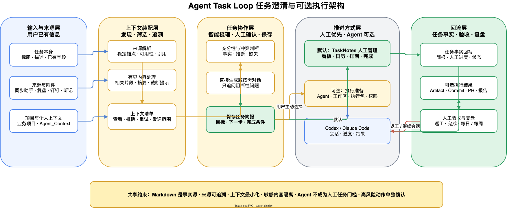
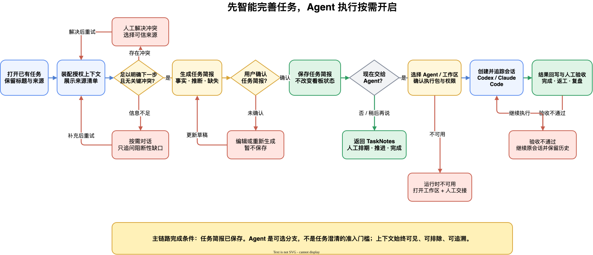

# Agent Task Loop 上下文感知任务澄清与可选 Agent 执行闭环 PRD

## 0. 文档信息

| 字段 | 内容 |
| --- | --- |
| 功能名 | 上下文感知任务澄清与可选 Agent 执行闭环 |
| 需求类型 | PRD-ai-native |
| 当前状态 | PRD 评审通过，Ready with assumptions |
| 关联模块 | Obsidian 插件、任务详情、上下文装配、模型服务、Agent Runtime、复盘 |
| 目标用户 | 以 Obsidian 管理个人任务并使用 Codex / Claude Code 工作的个人用户 |
| 更新时间 | 2026-07-26 |

**本期只解决一件事：让已有上下文的 Obsidian 任务先被 AI 有依据地想清楚并沉淀为可执行任务简报；用户既可以据此自行完成，也可以选择交给 Codex 或 Claude Code，并把后续结果回写到任务与复盘。**

### 0.1 文档关系

- 本 PRD 延续既有的人工优先任务管理、同步助手收集、钉钉日程、会议听记和附件能力。
- 本 PRD 替代旧设计中“AI 只读取标题和正文”“AI 整理只服务于移到待办”以及“Codex 仅复制上下文”的限制。
- TaskNotes 仍负责看板、日历、基础状态和人工拖动；ATL 不 fork TaskNotes，也不修改其内部实现。
- 当前旧 HTML 原型没有覆盖上下文清单、多轮澄清、工作区选择和执行会话，本 PRD 不把旧原型当作目标态证据。

## 1. 模块定位

该模块位于“任务被收集”与“用户开始行动”之间：它把分散在任务、来源笔记、附件、项目、代码工作区和个人上下文中的信息装配成可追溯上下文，由 AI 判断信息是否充分，生成可确认的任务简报。任务简报本身就是完整产物，不以是否启动 Agent 为完成条件。

模块按需产出三类结果：

1. 所有任务都可以产出用户确认的任务简报，供人工安排、讨论或执行。
2. 只有用户选择“交给 Agent”时，才生成面向 Codex 或 Claude Code 的执行包。
3. 只有实际启动 Agent 时，才产生会话、执行记录和产物回链。

## 2. 现状与问题

### 2.1 当前已具备能力

- 同步助手、每日复盘、手动输入和会议候选可以生成 Inbox 任务，并保留基础来源信息。
- TaskNotes 可以按状态展示任务、拖动看板卡片并使用日历安排时间。
- ATL 已有人工任务弹窗、模型服务配置、Claude Code 后台调研、Artifact、人工验收和审计能力。
- 会议流程可以关联听记与 `txt`、`md`、`docx`、`pdf` 资料，生成摘要、结论和待办候选。
- Codex 当前只有“复制给 Codex”的人工交接，不创建或追踪 Codex 会话。

### 2.2 当前缺口

- 任务已有标题、描述、来源段落、AI 听记和附件，但 AI 整理没有统一读取这些信息。
- AI 默认依附在“移到待办”轻量表单中，只生成目标和完成条件，既不能先判断信息是否足够，也没有形成独立的任务思考空间。
- 业务项目与实际代码工作区混在原始项目字段里，不能可靠决定 Agent 的执行目录。
- 个人背景、工作偏好、长期目标和权限规则没有一个用户可控的上下文入口。
- 长听记和大型项目如果整体进入 Prompt，会造成上下文噪声、成本上升和隐私风险。
- Agent 执行前没有冻结的确认版本，来源更新可能让执行目标悄悄变化。
- Codex / Claude Code 会话 ID、状态、最终回复、修改文件和产物没有形成统一回链。
- 每日和每周复盘能看到任务状态，但看不到“输入如何变成任务、任务如何变成产物”。

## 3. 功能目标

### 3.1 用户价值

1. 用户不需要重复填写已有信息，也不需要先理解大量技术字段。
2. 信息充分时，AI 可以直接生成任务简报；不足时，只追问真正阻止用户想清楚任务的问题。
3. 用户可以清楚知道 AI 读取了什么、依据什么生成、哪些内容只是推断。
4. 用户完成任务简报后可以直接回到看板、日历或线下工作，不需要选择 Agent、工作区或权限。
5. 用户确实要委托执行时，可以把任务关联到真实代码工作区，并从 Obsidian 启动、打开或继续 Agent 会话。
6. 任务执行结果、产物和验收记录不会散落在不同工具中。
7. 普通人工任务仍可直接拖动、排期和完成，AI 和 Agent 都不成为强制门槛。

### 3.2 AI 价值

- 从“被动填字段”升级为“先装配上下文、再判断、再生成”。
- 根据任务类型动态判断缺口，而不是固定询问同一套问题。
- 使用有来源的事实生成任务简报，并明确标注推断与缺失。
- 将松散对话压缩为稳定、可执行、可验收的任务输入。

### 3.3 试运行成功标准

- 所有 AI 使用的上下文均能在任务界面中查看来源并被用户排除。
- 已有充分上下文的任务无需对话即可生成可编辑任务简报。
- 需要澄清的任务只围绕阻断性缺口提问，不重复询问已有事实。
- AI 生成字段可以区分“来源事实、AI 推断、信息缺失”。
- 用户可以保存任务简报并结束 AI 协作，不配置 Agent、工作区和执行权限。
- 用户不启用 AI 时，现有人工看板、日历和状态管理不受影响。
- 任务启动 Agent 后可以回看 Agent、工作区、会话、状态和结果。
- 未经用户确认，不发生代码提交、推送、外部发送或长期记忆写入。

### 3.4 非目标

- 不开发新的看板或日历，不 fork TaskNotes。
- 不一期建设完整向量数据库或扫描全部个人历史。
- 不自动读取全部 Codex / Claude 历史会话作为个人记忆。
- 不实现 Agent、小队和 Skill 的自动编排。
- 不自动把一个任务拆成多个正式子任务并执行。
- 不自动修改钉钉日程或同步助手原文。
- 不把所有人工任务强制升级为 Agent 任务。
- 不默认允许 Agent 提交、推送、部署或对外发送。
- 不在本期承诺 Codex 实验接口创建的线程一定出现在当前 Codex Desktop 窗口。

## 4. 核心用户场景

### 场景一：同步助手任务已有足够信息

用户通过微信把一个明确待办发送给同步助手，ATL 已生成标题并保留来源消息。用户点击“智能完善任务”后，系统读取标题、来源消息和关联项目，基于已有信息生成目标、下一步动作和完成条件的可编辑建议，不再要求用户重复描述。用户补充并确认后保存简报，回到 TaskNotes 排期并自行完成，不需要进入 Agent 设置。

### 场景二：钉钉会议任务带有 AI 听记

用户从钉钉会议创建任务，并在本地会议笔记中加入 AI 听记和资料。系统读取钉钉元数据、会议摘要、候选行动及用户勾选的资料，发现“下一步”仍不明确，于是只追问用户希望自己跟进、与他人讨论，还是形成某个交付物。用户回答后，AI 更新任务简报并保留引用来源；任务可以停在人工执行阶段。

### 场景三：代码任务关联 Codex 项目

用户把任务归入业务项目，并选择 `TP翻译` 或 `style-work-backend` 工作区。系统有边界地读取仓库入口文档、项目规则、技术栈和 Git 状态，补充建议范围与验证方式。用户确认后选择 Codex、执行权限和工作区，系统创建执行会话并保存会话 ID；完成后把结果、改动和产物回写，用户验收后任务完成。

## 5. 双轨协作定义

| 阶段 | 人工动作 | AI / Agent 动作 | 系统反馈 | 边界 |
| --- | --- | --- | --- | --- |
| 收集 | 手动新建或确认候选 | 从来源生成候选标题和来源关系 | Inbox 卡片与来源入口 | 不自动进入待办或执行 |
| 上下文装配 | 打开任务，可排除来源 | 读取授权来源并生成上下文清单 | 已读取、不可用、已截断提示 | 不读取未授权文件 |
| 充分性判断 | 可补充或纠正 | 判断已有信息、冲突和阻断性缺口 | 可直接生成或显示待回答问题 | 不把推断冒充事实 |
| 任务完善 | 对话、编辑并确认 | 生成标题建议、任务简报和拆解 | 字段来源、修改差异、可撤销 | 简报可独立保存，不要求交给 Agent |
| 人工推进 | 排期、执行、讨论或完成 | 可按需继续提供思考支持 | 回到看板 / 日历，保留简报 | 不要求 Agent 字段或权限 |
| 执行准备（可选） | 主动选择“交给 Agent”、工作区和权限 | 生成冻结的执行包 | 准入检查和发送范围提示 | 高风险权限必须确认 |
| Agent 执行 | 查看、暂停、继续或接管 | 在指定工作区执行并持续报告状态 | 会话入口、进度、错误和产物 | 不越过执行包和权限 |
| 验收 | 查看结果、通过或要求修改 | 总结结果并在原会话继续返工 | 待验收、返工、完成 | Agent 不自行判定完成 |
| 复盘 | 查看项目与个人进展 | 汇总任务转化、产物、阻塞和待确认 | 每日 / 每周复盘条目 | 不把原始私密对话全文写入复盘 |

## 6. 图示总览

### 6.1 上下文感知任务执行架构



该图说明输入来源、上下文装配、AI 澄清、人工管理、可选 Agent 执行和结果回流之间的产品边界。所有来源继续保留在原位置，任务只保存引用、确认后的简报和实际发生的执行结果。

### 6.2 核心协作流程



该流程的关键判断不是“字段是否全部填写”，而是“现有上下文是否足以形成可执行建议，以及是否存在需要用户判断的缺口或冲突”。任务简报确认后默认返回人工管理；只有用户主动选择“交给 Agent”，才进入执行包和权限确认。

## 7. 主链路与阶段流转

1. 用户从任务卡片、任务文件菜单或 ATL 命令打开“智能完善任务”。
2. 系统读取任务本身，发现可追溯的来源、附件、业务项目、工作区和适用的个人上下文。
3. 系统展示本次上下文清单，并完成充分性、冲突和敏感内容判断。
4. 信息充分时直接生成任务简报；信息不足时进入对话，只追问阻止用户明确下一步或完成条件的问题。
5. 用户检查字段来源和修改差异，编辑后确认任务简报。
6. 系统保存任务简报并返回任务详情；用户可以回到看板 / 日历自行推进，这条主链路至此已经完成。
7. 用户主动选择“交给 Agent”时，才继续选择 Agent、工作区、执行方式和权限。
8. 系统冻结执行包、完成准入检查并启动 Agent；启动成功后保存会话关系。
9. Agent 结果回写任务，用户验收或在同一会话要求修改；验收通过后进入完成和复盘。

## 8. 上下文装配

### 8.1 上下文来源

| 来源 | 读取内容 | MVP 规则 |
| --- | --- | --- |
| 当前任务 | 原标题、描述、正文、已有用户字段 | 最高优先级，保留用户原文 |
| 来源笔记 | 同步助手消息、复盘段落、钉钉元数据、会议候选 | 使用来源锚点，不默认读取整日或整篇内容 |
| 任务附件 | AI 听记及用户关联的 `txt/md/docx/pdf` | 用户可见、可排除；长文先提炼相关内容 |
| 业务项目 | 项目目标、阶段、相关决策和项目说明 | 用于解释为什么做，不作为代码执行目录 |
| Agent 工作区 | 仓库入口文档、项目规则、技术栈、Git 状态 | 有界扫描，不在澄清阶段遍历全部代码 |
| 个人上下文 | 用户背景、偏好、长期目标、协作和权限规则 | 按范围、阶段和敏感度自动匹配，用户可移除 |
| 当前任务历史 | 已有执行结果、验收反馈和产物 | 只用于同一任务连续执行与避免重复工作 |

### 8.2 来源专属规则

#### 同步助手

- 优先保留收集时生成的标题；AI 只能提出标题建议，不能静默覆盖。
- 通过稳定来源关系读取产生该任务的具体消息和必要相邻内容。
- 不因为来源文件包含多个微信消息而把整日内容发送给模型。

#### 钉钉与会议听记

- 钉钉镜像保持只读，读取标题、时间、参与人、描述和稳定事件关系。
- 本地会议笔记中的 AI 听记、摘要、结论和用户选中资料可以作为上下文。
- 未勾选用于分析的资料不进入模型输入。
- 来源更新时提示上下文可能变化，不自动改变已经冻结的执行包。

#### 复盘

- 只读取生成候选行动的复盘段落和对应原始来源。
- 文章或链接本身不能自动被解释为用户必须执行的任务。

#### 手动任务

- 读取标题、描述、正文、关联笔记和附件。
- 没有来源笔记也不影响人工管理或 AI 澄清。

### 8.3 个人上下文区

个人上下文逐步建立在：

`07_System/Agent_Context/`

建议内容包括个人背景与角色、长期目标、工作与协作偏好、表达偏好、决策原则、项目关系与职责、AI 权限与禁止事项。

产品规则：

- 目录不存在或为空时，不报错、不阻塞任务完善。
- 适用内容按范围自动读取，并在界面明确展示，用户可为本次任务移除。
- 没有上下文声明的普通 Markdown 默认只参与任务澄清，不自动进入 Agent 执行包。
- 敏感或禁止外发的内容不发送给外部模型。
- 过期内容降级为参考，不覆盖任务中的新信息。
- Agent 新发现的长期信息只能生成“记忆候选”，经用户确认后才能写入。

### 8.4 Agent 工作区扫描

工作区由用户通过文件夹选择器建立本地注册表，至少显示名称、本地路径、关联 Git 仓库和默认 Agent。业务项目可以绑定一个或多个工作区，任务仍允许临时选择其他工作区。

澄清阶段只读取有助于判断任务的入口信息：

- `README`、`AGENTS.md`、`CLAUDE.md` 等项目说明和规则。
- 技术栈入口、文档索引和用户明确关联的文件。
- Git 仓库、当前分支和是否存在未提交修改等状态摘要。
- 根据任务关键词找到的少量候选路径，用户确认后再进一步读取。

真正执行时，Agent 获得确认后的工作区作为执行目录，并按批准权限读取所需代码。

### 8.5 上下文优先级与冲突

发生冲突时采用：

`用户最新修改 > 已确认任务简报 > 任务来源原文 > 项目规则 > 个人上下文 > AI 推断`

- 可安全合并的差异由 AI 生成建议。
- 影响目标、交付物、范围或权限的冲突必须交给用户选择。
- 来源失效、文件移动、附件无法解析或上下文被截断时，要展示具体来源状态。
- 用户可以查看本次实际发送给模型的来源范围，但不要求阅读内部 Prompt。

### 8.6 长内容处理

- 原始听记和文档保留在 Vault，不复制到任务字段。
- 模型优先接收相关摘要、关键结论、必要原文片段和来源链接。
- 发生截断时显示“部分读取”，不能把部分内容伪装成完整扫描。
- MVP 使用可追溯的显式来源和有限搜索，不建设全 Vault 语义索引。

## 9. AI 充分性判断与任务简报

### 9.1 判断原则

AI 根据任务类型检查是否存在阻止用户形成清晰行动的缺口，而不是要求所有任务填写相同字段。通用任务简报至少应回答：

- 目标清楚。
- 下一步动作或预期交付物清楚。
- 完成条件可以判断。

人工任务只需明确下一步动作和完成条件。只有用户准备交给 Agent 时，代码任务才额外需要工作区、修改范围、验证方式和执行权限；调研任务才额外需要核心问题、来源边界和输出形式；内容任务才额外需要目标读者、用途和形式。

### 9.2 判断结果

| 结果 | 系统行为 |
| --- | --- |
| 信息充分 | 直接生成任务简报，不强制发起对话 |
| 部分缺失 | 只追问当前阻止形成清晰行动的问题 |
| 信息冲突 | 展示冲突来源，由用户选择或补充 |
| 来源不可用 | 降级使用剩余内容，并明确缺失影响 |
| 简报已完成 | 保存后返回任务详情，可直接人工管理 |
| 用户选择 Agent | 展开独立的执行准备区，检查工作区、范围与权限 |

### 9.3 任务简报内容

- 当前标题与可选标题建议。
- 背景与问题。
- 任务目标。
- 预期交付物。
- 验收标准。
- 范围与非目标。
- 建议执行步骤。
- 输入材料与来源。
- 约束、风险、依赖和未决问题。
- 业务项目。
- 只有与任务相关时才显示建议工作区、执行方式与权限，且放在“交给 Agent”区域，不占据普通任务简报。

每项生成内容应尽可能显示“来源事实”或“AI 推断”。没有来源的建议不能伪装成用户要求。

### 9.4 对话与确认

- 首次打开先扫描上下文，再决定是否需要聊天。
- 每轮只集中处理少量高价值问题，用户回答后实时更新简报草稿。
- 用户可以手动编辑任何草稿字段，也可以要求重新生成单个区域。
- 写入任务前展示本轮变更；用户可以确认、撤销或继续修改。
- 用户点击“保存任务简报”后即可结束本次 AI 协作；系统不继续追问 Agent、工作区或权限。
- AI 不可用、超时或返回无效结果时，保留已有内容并允许用户人工编辑。

## 10. 可选的项目、工作区与 Agent 执行

### 10.1 两类项目概念

| 概念 | 用途 | 示例 |
| --- | --- | --- |
| 业务项目 | 看板分类、目标归属、每日和每周复盘 | Agent Task Loop、TP 翻译产品 |
| Agent 工作区 | Agent 实际读取和修改文件的本地目录 | `TP翻译`、`style-work-backend` 仓库目录 |

业务项目与工作区可以多对多关联。ATL 面向用户显示名称和目录选择，不再要求用户理解或填写原始项目 ID。普通任务可以只有业务项目，不必关联工作区。

### 10.2 执行方式

- **不交给 Agent**：默认选项，任务简报保存后由用户在看板、日历或线下继续推进。
- **交互式会话**：用户主动委托后，用于代码修改、复杂判断和需要中途沟通的任务。
- **后台执行**：仅用于已授权的只读调研、信息整理、比较和草稿。
- **人工交接**：运行时不可用时，打开目标工作区并复制确认后的执行包，作为可靠兜底。

### 10.3 Agent 选择

- 用户点击“交给 Agent”后，才需要选择 Codex 或 Claude Code；系统可以根据任务和工作区给出建议，但不能替用户最终决定。
- Codex MVP 优先使用可指定工作区、产生结构化事件并保存会话的稳定本地执行路径。
- Codex 原生桌面线程创建与打开作为增强能力，只有在独立验证其可见性和恢复行为后才默认启用。
- Claude Code 延续当前后台执行能力；交互式连续执行需要保存可恢复的会话关系。
- 两个 Agent 使用各自现有的认证与运行时配置，ATL 不保存 API Key。

### 10.4 执行权限

用户选择简化后的权限档位：

1. 只读调研：读取、搜索、整理、比较、生成草稿，可按已确认规则自动执行。
2. 允许本地修改：可以修改选定工作区，但启动前必须确认。
3. 允许提交：Commit、Push、PR、部署和外部发送仍分别需要明确确认，不由“本地修改”隐含授权。

权限建议可以由 AI 生成，但最终选择属于用户。工作区不存在、运行时未登录、权限不足或仓库状态不适合执行时，不启动会话并提供人工交接。

### 10.5 执行包

用户确认后生成冻结的执行包，包含：

- 确认后的任务简报。
- 用户选中的上下文及来源关系。
- Agent 与工作区。
- 执行方式、权限和禁止事项。
- 验证要求和预期产物。

执行包生成后，来源笔记或个人上下文的变化不会静默改变本次任务。用户可主动“更新执行包”，查看差异并再次确认。

### 10.6 会话与结果回写

实际启动 Agent 的任务需要展示：

- Agent、工作区和执行方式。
- 会话 ID 对应的“打开会话”或“继续会话”入口。
- 启动、运行、等待用户、失败、待验收等状态。
- 最终回复摘要、修改文件、Commit / PR、报告和其他产物。
- 验收通过、返工意见和后续会话关系。

Agent 完成执行不等于任务完成。任务保持执行中并显示“待验收”；只有用户验收通过后才进入完成。要求修改时优先继续原会话，并保留历史结果。

## 11. 页面结构与信息布局

### 11.1 页面边界

- TaskNotes 继续提供看板、日历、状态拖动和基础任务编辑。
- ATL 在自己拥有的任务详情弹窗中提供上下文装配、AI 澄清、执行和结果区域。
- 入口至少包括任务文件菜单和 ATL 命令；如 TaskNotes 没有公开扩展点，不向其私有 DOM 注入按钮。
- AI 不可用时，ATL 任务详情仍允许人工查看和编辑任务简报。

### 11.2 目标信息结构

```text
任务标题 / 看板状态 / 计划时间 / 优先级
来源 / 业务项目

[智能完善任务]
基于已有信息智能梳理任务上下文，并通过对话与你共同补全目标、行动步骤和完成标准。
已读取上下文：任务 · 来源笔记 · 听记 · 项目 · 工作区 · 个人上下文
可展开查看、排除和重试

对话区
仅在信息不足、冲突或用户主动提问时展开

智能建议
背景 · 目标 · 交付物 · 验收标准 · 范围 · 步骤 · 风险
每个区域显示来源或“AI 推断”

[确认并保存]
确认后保存为任务简报，可直接回到 TaskNotes 看板 / 日历自行推进

交给 Agent（可选，默认收起）
用户主动展开后显示 Agent · 工作区 · 执行方式 · 权限 · 开始执行

执行结果
状态 · 会话入口 · 结果摘要 · 产物 · 验收 / 要求修改
```

### 11.3 字段展示改造

日常编辑界面隐藏但保留底层数据：`contexts`、`tags`、TaskNotes 原生项目字段、阻塞关系、ATL 原始项目 ID、评审状态、任务 ID 和评审反馈。

以下字段改成用户语言：

- 原始自动执行开关改为“交给 Agent”流程。
- 来源字段显示为人类可读来源和可打开的来源笔记。
- 产物路径改为“执行结果”，以文件、Commit、PR 或报告卡片展示。
- 业务项目与 Agent 工作区分别展示，不暴露原始 ID。

### 11.4 关键页面状态

- 默认态：已有任务信息，尚未扫描上下文。
- 读取中：逐项显示正在读取的来源，不冻结人工编辑。
- 信息充分：直接展示任务简报草稿。
- 需要补充：展开对话并标记缺失项。
- 存在冲突：并列展示冲突来源和选择入口。
- 模型失败：保留任务和已读取内容，可重试或人工编辑。
- 简报已保存：显示目标、下一步和完成条件，主操作为“返回任务”，Agent 区保持收起。
- 执行准备：展示执行包摘要和权限确认。
- 运行中：展示 Agent、工作区、状态和会话入口。
- 待验收：展示结果和产物，提供验收与要求修改。
- 运行时不可用：展示原因、重新检测和人工交接。

正式视觉交接稿位于 `docs/mockups/context-aware-task-clarification/`，基于真实 Obsidian 组件和现有 ATL Modal 约束，覆盖信息充分、需要补充、上下文冲突、简报已保存、执行准备、运行中、待验收、模型失败和运行时失败。

## 12. 状态反馈与两套状态关系

### 12.1 人工看板状态

默认仍为：

`收件箱 -> 待办 -> 进行中 -> 已完成`

名称、颜色、顺序和扩展状态由 TaskNotes 管理。ATL 不根据中文显示名称推断执行语义。

### 12.2 ATL 内部协作状态

`未整理 -> 正在读取 -> 需要补充 / 可确认 -> 已确认 -> 启动中 -> 运行中 -> 等待用户 / 待验收 -> 成功 / 失败`

状态映射规则：

- 人工任务可以绕过 ATL 内部协作状态，自由使用看板。
- 任务简报确认只更新澄清状态，不自动改变看板状态，也不进入 Agent 状态。
- 简报保存后用户可以继续人工推进；后续任何时间仍可重新打开并选择“交给 Agent”。
- 启动 Agent 成功后，任务进入“进行中”；启动失败不移动看板状态。
- Agent 返回结果后，任务仍保持“进行中”，附加“待验收”。
- 用户验收通过后进入“已完成”。
- 执行失败显示失败或阻塞标识，不强制创建新的 TaskNotes 看板列。

## 13. 数据闭环与复盘

### 13.1 任务级闭环

每个任务先形成一条不依赖 Agent 的可追溯主链路：

`来源 -> 任务 -> 上下文清单 -> 澄清与确认 -> 任务简报 -> 人工排期 / 推进 / 完成`

只有用户主动委托时，才从任务简报继续形成可选执行链路：

`任务简报 -> 执行包 -> Agent 会话 -> 产物 -> 人工验收`

完整对话记录保存在 Vault 内 ATL 审计区；任务正文只保留用户确认后的任务简报、当前执行摘要和可读结果，避免任务文件被长对话淹没。

### 13.2 每日复盘

每日复盘汇总：

- 新增、已完善、已启动、已完成、待验收和阻塞任务。
- 当天确认的关键目标、范围和决策。
- Agent 生成的产物和需要用户处理的事项。
- 来源到任务、任务到产物的转化，不写入原始私密对话全文。

### 13.3 每周复盘

每周复盘按业务项目汇总：

- 输入转为正式任务的情况。
- 已执行、已验收、返工和长期未推进的任务。
- 产生的报告、代码、Commit、PR 和可复用资产。
- 持续阻塞、重复出现的上下文缺口和可沉淀记忆候选。
- 人工决策与 Agent 贡献，不把运行次数当作成果。

### 13.4 个人记忆闭环

- 任务和 Agent 可以提出新的个人上下文候选。
- 候选必须显示来源、建议放置位置和适用范围。
- 用户确认后才写入 `07_System/Agent_Context/`。
- 临时任务事实、未经确认的推断、敏感执行日志和失败输出不进入长期个人上下文。

## 14. 模块拆解与输入输出

| 模块 | 主要输入 | 主要输出 |
| --- | --- | --- |
| 任务详情 | 任务 Markdown、TaskNotes 状态 | 用户可见任务信息和操作入口 |
| 上下文发现 | 任务来源、附件、项目、工作区、个人上下文 | 可查看和可排除的上下文清单 |
| 文档处理 | 用户授权的听记与文档 | 摘要、相关片段、引用和解析状态 |
| 充分性判断 | 上下文清单、任务类型 | 可直接生成、缺失问题或冲突提示 |
| 任务简报 | 事实、用户回答和 AI 建议 | 用户可编辑、可确认的结构化任务 |
| 工作区管理 | 用户选择的目录和业务项目 | 可复用工作区及建议映射 |
| 执行准备 | 已确认任务、工作区、Agent、权限 | 冻结执行包与准入结果 |
| Agent 运行 | 执行包和 Agent Runtime | 会话、进度、结果、产物或失败 |
| 人工验收 | 执行结果和用户反馈 | 完成、返工或阻塞结论 |
| 复盘回写 | 任务事件、结果和项目关系 | 每日 / 每周可读摘要与记忆候选 |

## 15. 人工接管机制

以下情况必须停止自动继续并等待用户：

- 目标、交付物、验收标准或执行范围存在关键冲突。
- AI 需要读取未授权、敏感或禁止外发的上下文。
- 代码任务未选择有效工作区。
- 执行权限从只读升级为本地修改、提交、推送、部署或外部发送。
- 工作区不存在、运行时未安装或登录失效。
- Agent 发现执行包与代码现实明显冲突，需要改变任务范围。
- Agent 已生成结果并等待验收。
- Agent 建议把新信息写入长期个人上下文。

用户可通过以下方式恢复：排除问题来源、补充回答、重新生成单个字段、更新执行包、切换 Agent、切换工作区、降级为人工交接、重试或继续原会话。

## 16. 异常与边界

| 异常 | 用户可见反馈 | 系统处理 |
| --- | --- | --- |
| 来源笔记丢失 | 标明具体来源不可用 | 使用剩余内容，不删除来源关系 |
| 附件无法解析 | 显示文件名和稳定错误 | 原文件保留，不发送损坏内容 |
| 长文被截断 | 显示部分读取和影响范围 | 使用摘要和已读取片段 |
| 上下文冲突 | 并列显示冲突内容和来源 | 等待用户选择，不自动合并关键字段 |
| 个人上下文为空 | 显示尚未建立 | 继续使用任务、来源和项目上下文 |
| 模型未配置或失败 | 保留现有内容，可重试 | 人工编辑和看板管理继续可用 |
| 工作区路径失效 | 标明工作区不可用 | 禁止启动 Agent，允许重新选择 |
| 工作区有未提交修改 | 展示仓库状态 | 由执行权限和分支策略决定是否继续 |
| Agent 未安装或未登录 | 给出重新检测与人工交接 | 不改变任务状态 |
| 启动后无法取得会话 ID | 标为启动未建立关联 | 不宣称成功，允许重试或人工交接 |
| 执行中断或超时 | 展示最后状态和可恢复操作 | 保留日志和执行包，可继续或重试 |
| 来源在执行中更新 | 提示执行使用旧快照 | 不静默改变当前会话输入 |
| 用户拒绝结果 | 收集返工意见 | 优先继续原会话并保留历史 |

## 17. 验收标准

### 17.1 上下文与 AI 澄清

1. 从同步助手、复盘、钉钉、会议和手动任务打开 ATL 任务详情时，系统能识别任务已有信息并显示来源。
2. 同步助手生成的已有标题不会被 AI 静默替换。
3. 来源锚点存在时只读取相关段落，不把整日同步助手内容默认发送给模型。
4. 用户可以查看并排除任务、来源笔记、附件、项目、工作区和个人上下文。
5. `07_System/Agent_Context/` 不存在或为空时，任务完善仍可完成。
6. 信息充分时系统直接生成任务简报；信息不足时只询问阻断性问题。
7. 任务简报覆盖目标、下一步动作、预期交付物和完成条件，并允许用户编辑、确认和撤销；非交付型任务不强制虚构交付物。
8. AI 生成内容能区分来源事实与 AI 推断；冲突内容不会被静默合并。
9. 模型失败时不丢失任务原文、用户回答或已有字段，人工流程仍可继续。
10. 用户只点击“保存任务简报”即可完成本次任务澄清，不需要选择 Agent、工作区、执行方式或权限。
11. 保存任务简报不会自动改变 TaskNotes 看板状态、安排日期或项目归属。
12. 已保存简报的任务可以直接返回 TaskNotes 由用户排期、推进和完成，也可以在以后重新打开并选择“交给 Agent”。

### 17.2 项目、工作区与执行

13. 用户可以分别选择业务项目和 Agent 工作区，两者不会再以同一个原始字段呈现。
14. 用户可以通过文件夹选择器建立工作区，并看到目录有效性和 Git 状态摘要。
15. 代码任务在没有有效工作区时不能启动 Agent，但可以继续人工管理。
16. 用户可以选择 Codex 或 Claude Code，并看到当前运行时是否可用。
17. Agent 启动前展示执行包、上下文发送范围和权限；本地修改及以上权限需要确认。
18. 启动成功后任务能回看 Agent、工作区、会话入口和当前状态。
19. 无法建立会话关系时系统不会把任务标记为成功启动，并提供人工交接。
20. Agent 结果能以可读方式展示最终摘要、修改文件和 Artifact；原始路径字段不占据日常编辑界面。
21. Agent 返回结果后任务进入待验收，不会自动完成；用户可验收或要求修改。

### 17.3 安全、兼容与闭环

22. 普通任务无需 AI、项目或 Agent 字段即可在 TaskNotes 看板和日历中管理。
23. TaskNotes 状态、日历字段和用户自定义字段在 ATL 读取保存后保持不变。
24. ATL 不修改 TaskNotes 插件文件、钉钉镜像或同步助手来源文件。
25. 未选资料、敏感个人上下文和禁止外发内容不会出现在模型输入中。
26. API Key 不写入任务、Vault、日志、执行包或 Agent 结果。
27. 提交、推送、部署、外部发送和长期记忆写入均有独立人工确认点。
28. 每日和每周复盘能够关联任务来源、任务简报、Agent 会话、产物和验收结果，但不复制完整私密对话。
29. 既有任务收集、去重、会议附件、Claude 调研 Runner、Artifact、审计和人工验收能力回归通过。

## 18. 风险与应对

| 风险 | 影响 | 应对 |
| --- | --- | --- |
| 上下文过多 | 响应慢、成本高、结论偏离 | 显式来源、有限读取、长文摘要、发送前可见 |
| 个人上下文过期 | AI 使用错误偏好或目标 | 显示更新时间、降级为参考、用户可移除 |
| 敏感信息外发 | 隐私或合规风险 | 敏感分级、默认排除、模型发送范围提示 |
| 来源锚点不稳定 | 读取错消息或错段落 | 稳定来源关系、引用预览、找不到时降级而非猜测 |
| 工作区扫描过重 | Obsidian 卡顿 | 入口文件优先、后台读取、限制候选路径 |
| Agent 改动超范围 | 破坏代码或用户数据 | 冻结执行包、权限分级、仓库状态检查、人工验收 |
| Codex Desktop 接口实验性 | 会话无法在桌面打开 | 稳定执行路径为主，人工交接兜底，实验能力单独验证 |
| Claude 会话不可恢复 | 返工无法延续上下文 | 保存可恢复会话关系，否则明确降级为新会话 |
| 两套状态让用户困惑 | 看板与 Agent 状态不一致 | 看板保持简洁，Agent 状态只在卡片徽标和详情显示 |
| 记忆被错误沉淀 | 长期影响后续任务 | 只生成记忆候选，用户确认后写入 |

## 19. 分期范围

### MVP-1：智能完善任务（独立上线边界）

- ATL 任务详情中的上下文清单、充分性判断、按需对话和任务简报。
- 读取任务本身、稳定来源段落、已支持附件、业务项目说明和 `Agent_Context`。
- 用户可以只保存任务简报并返回 TaskNotes；保存不改变看板状态、排期或 Agent 状态。
- 已有信息充分时直接生成；不足时只追问阻断性问题；冲突时由用户选择可信来源。
- 模型不可用时保留人工编辑与原有 TaskNotes 管理能力。
- 现有人工看板、日历、会议分析、Claude 后台调研和人工交接继续可用。

### MVP-2：可选 Agent 执行闭环

- 业务项目与 Agent 工作区分离，工作区可通过文件夹选择器管理。
- 用户主动展开“交给 Agent”后，才出现 Codex / Claude Code、执行方式和权限。
- 生成冻结执行包，完成运行时准入、会话关系、结果回写和人工验收。
- 每日 / 每周复盘读取实际发生的任务执行事件和产物关系。

### 后续增强

- 全 Vault 和跨项目语义检索。
- 从最近 Codex 工作目录自动推荐或导入工作区。
- 经验证的 Codex Desktop 原生线程创建、定位和恢复。
- 相关历史任务、跨任务产物和人物 / 主题上下文推荐。
- Agent 自动提出子任务、Skill 和小队编排建议。
- 个人上下文质量检查、过期提醒和冲突治理。

## 20. 假设、待确认与评审项

### 已确认

- 个人上下文使用 `07_System/Agent_Context/`，逐步建设，按适用范围自动读取、明确展示并允许移除。
- 普通人工任务不被 AI 准入条件阻塞。
- TaskNotes 保持看板与日历展示引擎，ATL 负责任务澄清和 Agent 执行。
- 业务项目与 Agent 工作区是两个不同概念。
- 只读调研、整理、比较和草稿可按授权自动执行；本地修改及更高风险动作需确认。
- 钉钉与同步助手来源保持只读。

### 非阻断假设

- 完整澄清对话保存在 Vault 的 ATL 审计区，任务正文只保留确认结果。
- Codex 稳定本地执行路径作为 MVP 主路径，桌面原生线程作为验证后的增强能力。
- 模型服务沿用现有可配置 Model / Base URL 方案，执行 Agent 使用自身认证，ATL 不保存密钥。

### PRD 评审项

- 验证 Codex 会话 ID 的创建、恢复及与当前 Codex Desktop 的可见性边界。
- 确认 Claude Code 连续会话的保存方式不会破坏现有受控调研 Runner。
- 确认业务项目现有 Markdown 与工作区注册表的映射和迁移策略。

以上三项只影响 MVP-2，不阻断 MVP-1 开发。

## 21. 本地草稿附录

- 旧总 PRD：`docs/PRD-Agent-Task-Loop-V0.1.md`
- 上下文架构图：`docs/diagrams/context-aware-task-architecture.drawio`
- 核心流程图：`docs/diagrams/context-aware-task-core-flow.drawio`
- 正式 UI 交接稿：`docs/mockups/context-aware-task-clarification/README.md`
- PRD 评审报告：`docs/reviews/PRD-Context-Aware-Task-Clarification-and-Agent-Execution-review.md`
- 开发计划：`plans/context-aware-task-clarification-and-optional-agent-execution.md`
